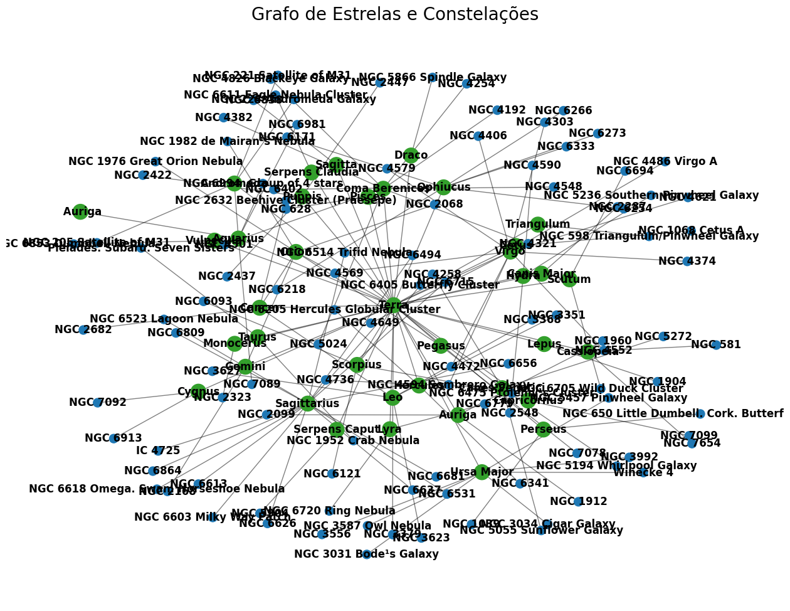
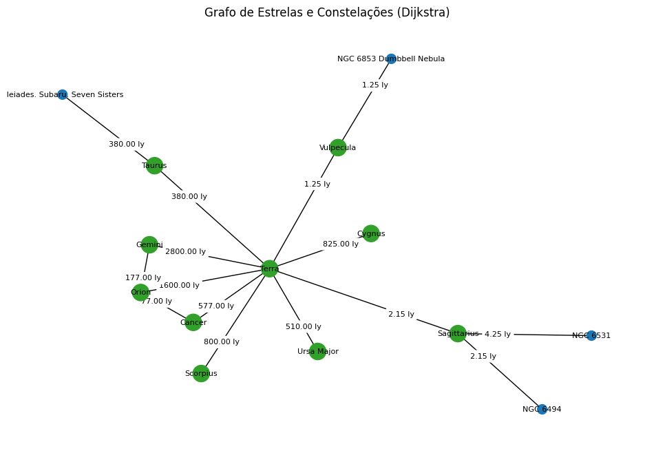
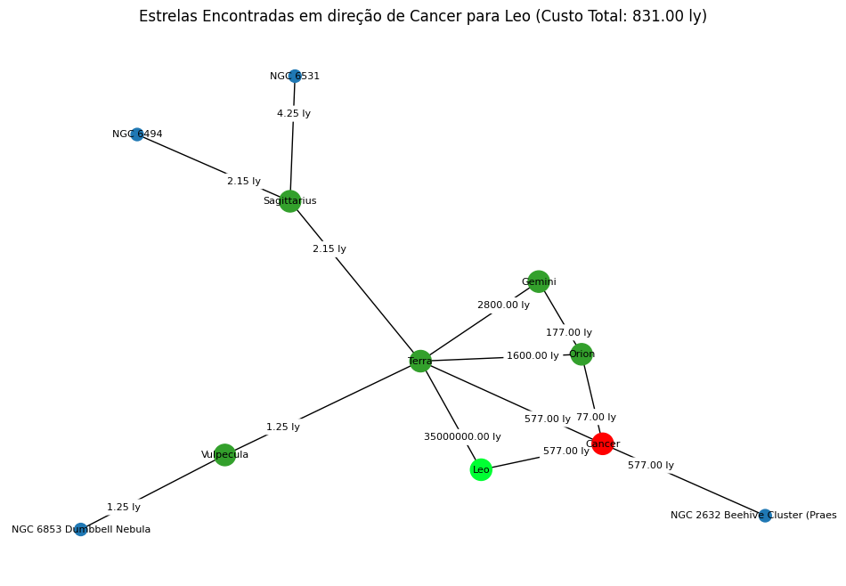

# Temas:
 - Grafos2
 
## Grafos Estrelas do Céu

**Número da Lista**: X<br>
**Conteúdo da Disciplina**: XXXXXXXXXX<br>

## Alunos
| Matrícula | Aluno                            |
| ---       | ---                              |
| 19/0048760 | Wellington Jonathan de Souza Rodrigues |

## Sobre
O objetivo do código é criar um grafo que representa as conexões entre as estrelas e a Terra, considerando sua magnitude e sua distância em anos-luz da Terra. O grafo tem como fonte com alterações para melhor visualização e compreensão das conexões. Os principais objetivos do código são:

- Carregar um conjunto de dados que contém informações sobre estrelas e suas associações com constelações.
- Representar cada estrela como um nó no grafo, e a associação com sua constelação como uma aresta.
- Utilizar o algoritmo de Dijkstra para calcular quais estrelas podem ser encontradas quando informada uma distância máxima da Terra.
- Utilizar o algoritmo de Prim para gerar a árvore geradora mínima e calcular o custo total em anos-luz para passar por todas as estrelas da árvore referente ao grafo informado.

Em resumo, esse código permite observar os dois algoritmos dentro de um contexto de distância das estrelas para a Terra.

## Screenshots
Adicione 3 ou mais screenshots do projeto em funcionamento.

## Instalação
**Linguagem**: Python 3.x
**Framework**: Jupyter Notebook

### Pré-requisitos
Certifique-se de ter as seguintes ferramentas e bibliotecas instaladas:

- Python 3.x (https://www.python.org/downloads/)
- NetworkX (biblioteca para criar e manipular grafos)
- Matplotlib (biblioteca para plotar o grafo)


# Criação de um Grafo de Artistas Relacionados no Spotify

Este guia descreve como usar o código Python para  visualizar o grafo de distancia das estrelas para Terra..

## Pré-requisitos

Certifique-se de ter as seguintes ferramentas e bibliotecas instaladas:

- Python 3.x (https://www.python.org/downloads/)
- NetworkX (biblioteca para criar e manipular grafos): 
- Matplotlib (biblioteca para plotar o grafo): 

```
pip install pandas
pip install networkx
pip install matplotlib

```

## Configuração

## Utilização
1. Abra o arquivo "Grafo2_distancia_estrelar.ipynb" no Jupyter Notebook ou no Vscode .
2. Execute as células de código conforme necessário para carregar e analisar os dados estelares, aplicar os algoritmos  e Prim e visualizar o grafo gerado.
3. Certifique-se de fornecer os parâmetros de entrada relevantes, como a distância máxima da Terra e o vértice de origem.

## Exemplo
Aqui está um exemplo de como utilizar o código para criar e visualizar o grafo estelar:

```python
# Importe as bibliotecas necessárias e carregue os dados estelares.
import networkx as nx
import matplotlib.pyplot as plt


...

# Defina a distância máxima desejada e o vértice de origem.
max_distance = 100  # Distância máxima da Terra (em anos-luz)
source_vertex = 'Terra'  # Vértice de origem

# Execute o código para criar o grafo e calcular a árvore geradora mínima.
G, min_spanning_tree, total_cost = criar_grafo_estrelas(max_distance, source_vertex)

# Plotar o grafo e a árvore geradora mínima.
plotar_grafo_com_subgrafo(G, source_vertex, min_spanning_tree, max_distance)

...

# Exemplo de Grafos 

## grafo 01


## grafo 02


## grafo 03


## grafo 04
